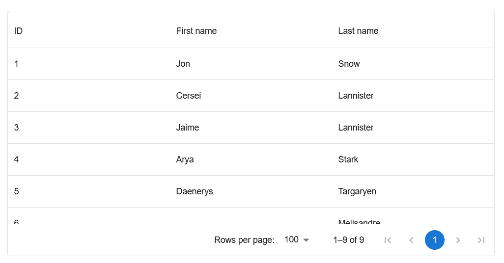
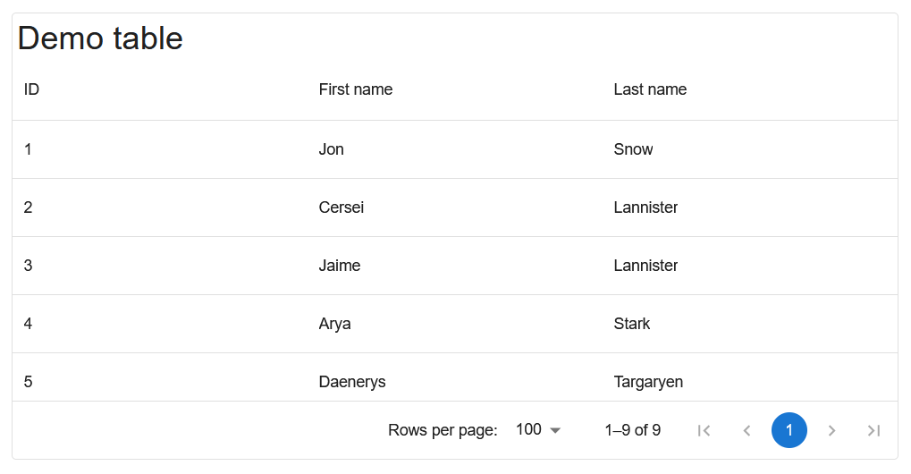
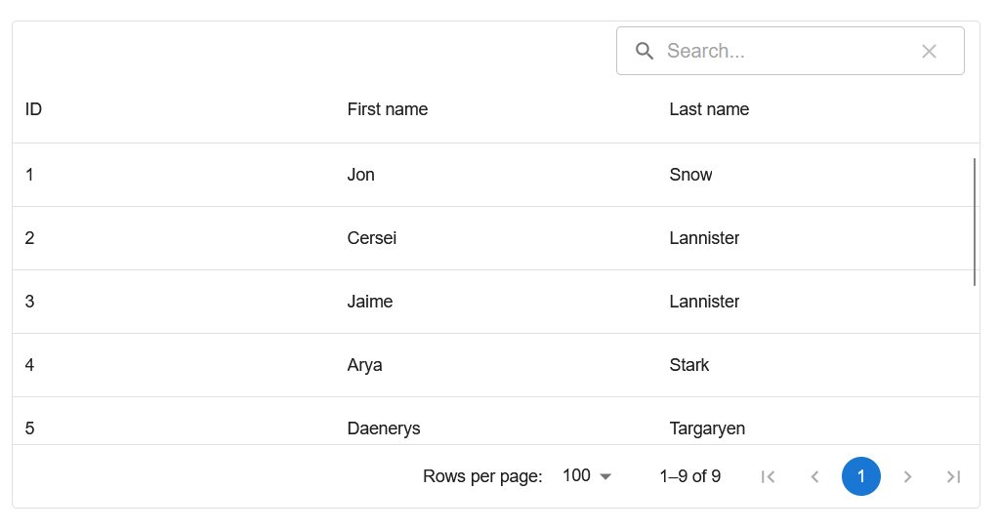
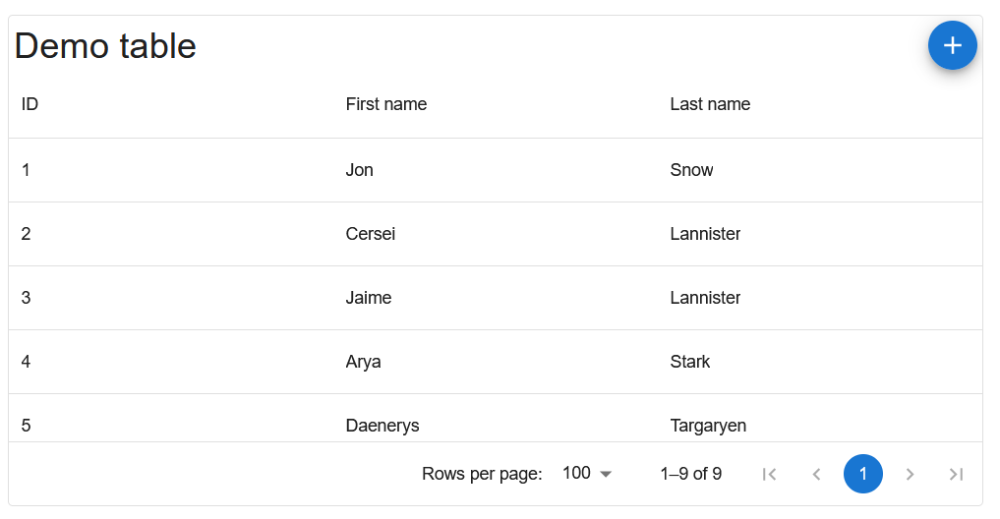
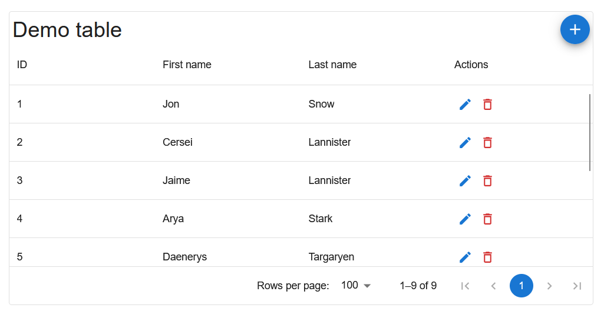
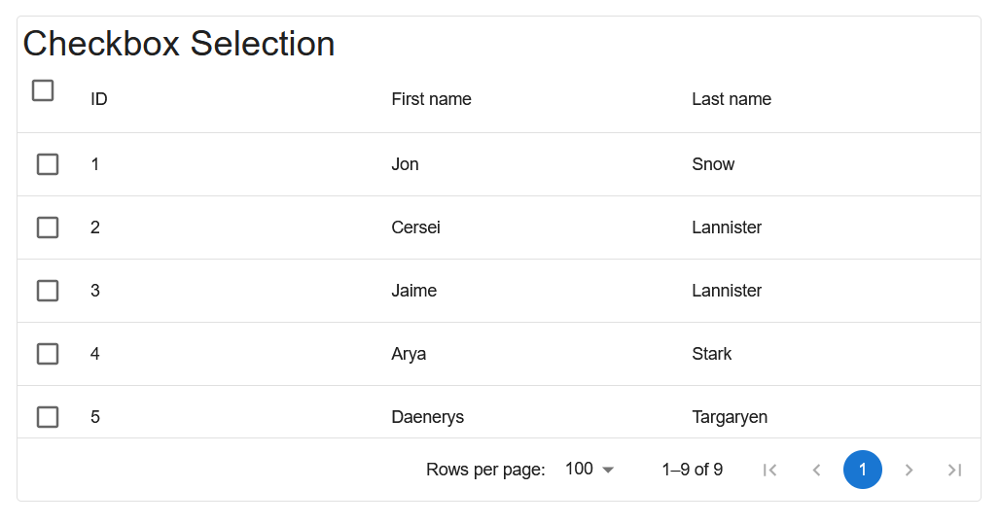
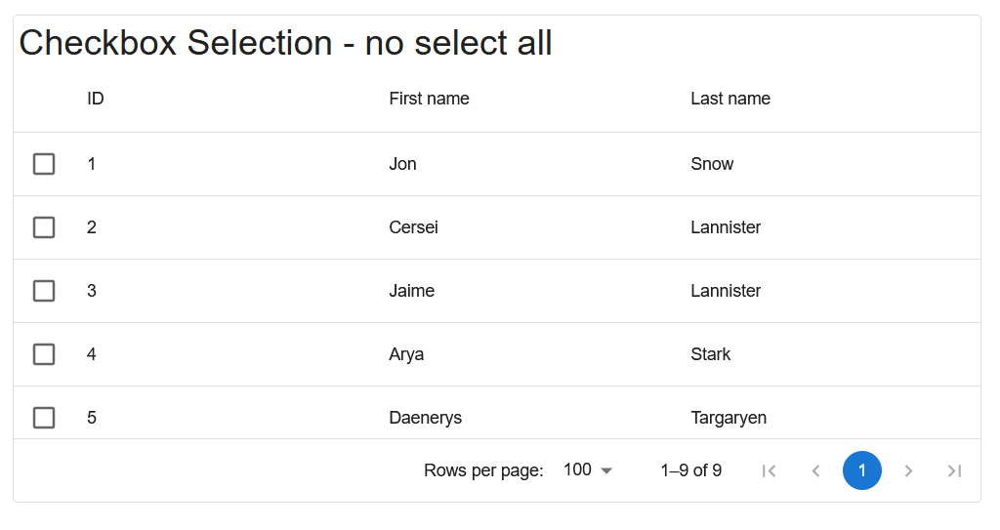
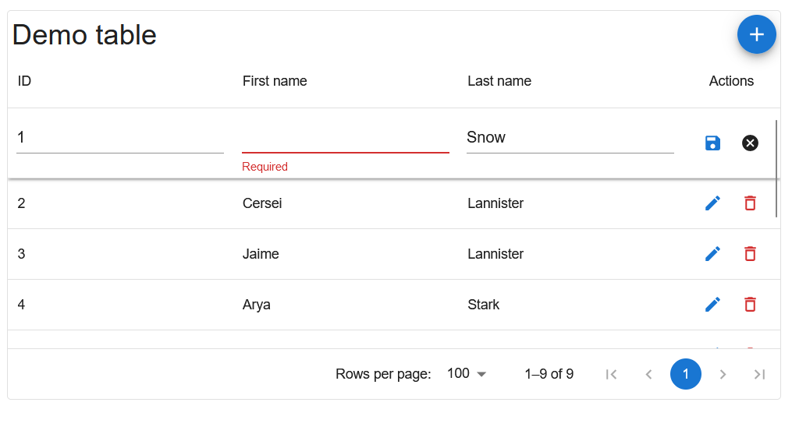
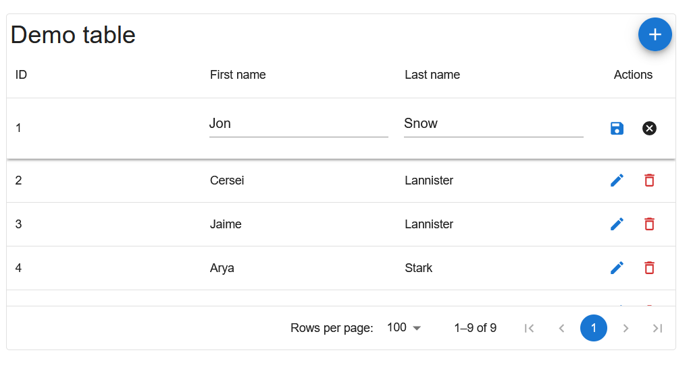

# MUI DataGrid with CRUD

## Features

- MUI DataGrid to display data
- Support inline edit
- Support validation with yup schema

## Getting Started

### Install Dependencies

```
pnpm install
```

### Run

```
pnpm dev
```

## Basic usage

To use `AppDataGrid` we need to define `columns` and `data`

`columns` of type `AppGridColumnDef` is a small wrapper of `GridColumnDef` exposed by `DataGrid`,
see [how to define columns here](https://mui.com/x/react-data-grid/column-definition/)

`data` can be a function to fetch data from server or array of objects,
see [how to define rows here](https://mui.com/x/react-data-grid/row-definition/)

Note: Each row must have a unique identifier, normally it is ID column. If your data does have ID column, define column
which is used as ID as mentioned [here](https://mui.com/x/react-data-grid/row-definition/#row-identifier)

```typescript jsx
const columns: AppGridColDef[] = [
  {
    headerName: 'First Name',
    field: 'firstName',
    flex: 2,
  },
  {
    headerName: 'Last Name',
    field: 'lastName',
  },
  // ...
];

const getData = async (query: AppQueryParam): Promise<AppQueryResult> => {
  // Getting data here, can use pagination, sorting, searchText exposed by query
};

<AppDataGrid
  columns={columns}
  data={data}
/>
```



## Title

To name your table, use `gridTitle` attribute, this attribute accepts `React.ReactNode` which means it can be a string (
rendered as un-styled element), custom component or `null`

Note: `undefined` is not a valid `React.ReactNode`

```typescript jsx
<AppDataGrid
  columns={columns}
  data={data}
  gridTitle={<Typography variant="h4">Demo table</Typography>}
/>
```



## Searching

To enable search feature, add attribute `enableSearch` as the code below

Value you entered to this search box would be returned in `AppQueryParam`, you can use that value to call API, ect...

```typescript jsx
<AppDataGrid
  columns={columns}
  data={data}
  enableSearch  
/>
```



## Add button

Add button would be automatically rendered at the top right of the table when you provide value for `onAdd` attribute

```typescript jsx
<AppDataGrid
  columns={columns}
  data={data}
  onAdd={() => console.log('Add')}  
/>
```



## Custom buttons

To add action buttons like Edit, Delete, you can use this sample code

```typescript jsx
const onEditUser = (id: GridRowId) => {
  console.log('Editing user id: ', id);
};

const onDeleteUser = (id: GridRowId) => {
  console.log('Editing user id: ', id);
};

const columns: AppGridColDef[] = [
  { field: 'id', headerName: 'ID', width: 90 },
  {
    field: 'firstName',
    headerName: 'First name',
    width: 150,
    editable: true,
  },
  {
    field: 'lastName',
    headerName: 'Last name',
    width: 150,
    editable: true,
  },
  {
    field: 'actions',
    headerName: 'Actions',
    width: 150,
    renderCell: (params) => {
      return [
        <GridEditButton key="edit" rowId={params.id} onClick={onEditUser} />,
        <GridDeleteButton key="delete" rowId={params.id} onClick={onDeleteUser} />,
      ];
    },
  },
];

<AppDataGrid
  columns={columns}
  data={data}
  onAdd={() => console.log('Add')}  
/>
```

Read further about [how to render cells here](https://mui.com/x/react-data-grid/column-definition/#rendering-cells)



## Selection

Enable selection by adding `showCheckboxSelection` attribute

```typescript jsx
<AppDataGrid
  columns={columns}
  data={data}
  showCheckboxSelection  
/>
```



Some case required use to hide select all button. To do that, use `hideSelectAllButton` along
with `showCheckboxSelection` attribute

```typescript jsx
<AppDataGrid
  columns={columns}
  data={data}
  showCheckboxSelection
  hideSelectAllButton
/>
```



To use return values selected row(s), pass a function to `onRowSelectionChange` event, this event have signature
of `(model: GridRowSelectionModel) => void`

```typescript jsx
<AppDataGrid
  columns={columns}
  data={data}
  showCheckboxSelection
  onRowSelectionChange={(model: GridRowSelectionModel) => console.log(model)}
/>
```

## Inline Editing

This feature is not well implemented. For now, it only supports text field. If you need to use this component with
Inline edit, PRs are welcome :D

Follow instruction here to create more components for inline edit
feature [Create your own edit component](https://mui.com/x/react-data-grid/editing/#create-your-own-edit-component)

To use Inline editing, you need to enable `enableInlineEdit` attribute

Once this attribute is set to `true`, Actions column would be rendered automatically, you should remove your actions
column if any to prevent error

In column definition, you can define how to validate values by using `yupSchema`, it's the same way as yup validation
schema you defined in forms

You can disable fields which you don't want user to edit by set `editable: false` in column definition

```typescript jsx
const columns: AppGridColDef[] = [
  {
    field: 'id',
    headerName: 'ID',
    width: 90,
    editable: false // Not allow user to edit ID
  },
  {
    field: 'firstName',
    headerName: 'First name',
    width: 150,
    editable: true, // Allow user to edit this column
    yupSchema: string().required('Required'), // Yup schema here
  },
  {
    field: 'lastName',
    headerName: 'Last name',
    width: 150,
    editable: true,
  },
  //...
];

<AppDataGrid
  columns={columns}
  data={data}
  onAdd={() => console.log('Add')}
  enableInlineEdit
/>
```




